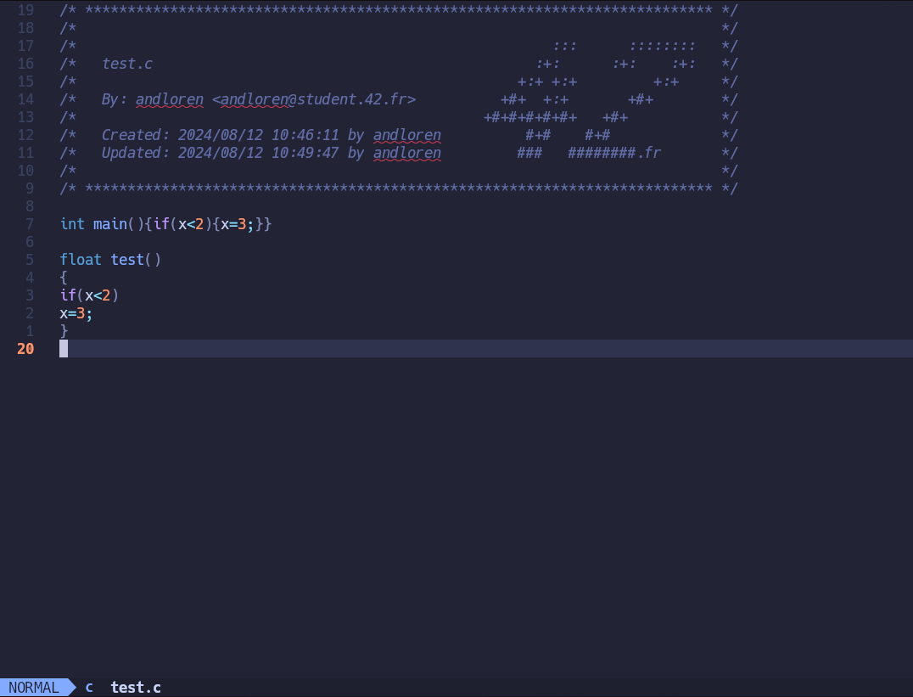
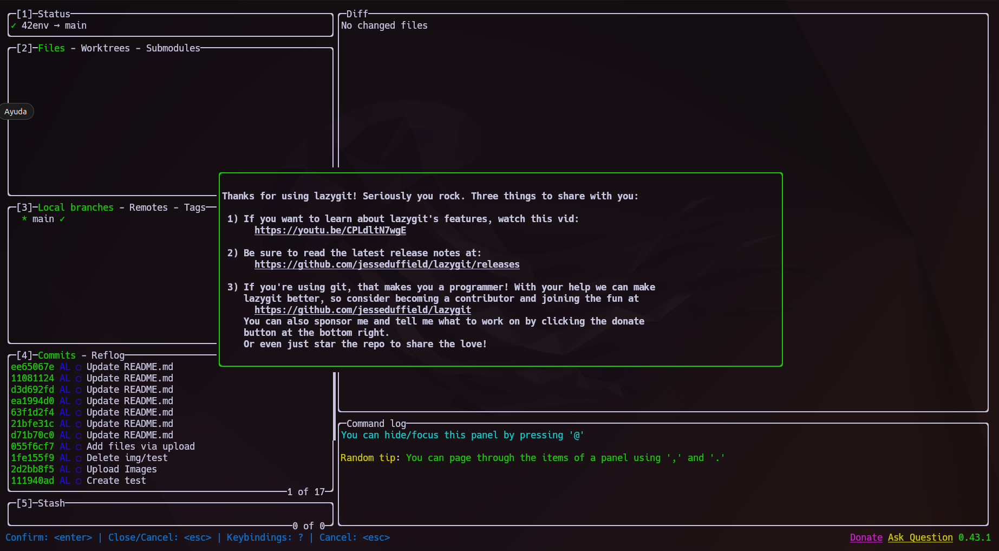

<div align="center">
  
</div>

# 42 ENVironment Configuration Script
Automatiza la instalación y configuración del entorno básico necesario para programar en el cursus de 42.
|---|
|<p align="center">Testeado en [Ubuntu 22.04 LTS](https://releases.ubuntu.com/jammy/)</p>|

<!-- Índice -->
# Índice

1. [Software](#software)
2. [Recomendaciones](#recomendaciones)
3. [Instalación](#instalación)
4. [Durante la ejecución](#durante-la-ejecución)
5. [LazyVim](#lazyvim)
    - [Uso básico de LazyVim](#uso-básico-de-lazyvim)
    - [Pestañas en LazyVim](#pestañas-en-lazyvim)
6. [Extras](#extras)
    - [LSD (LSDeluxe)](#lsd-lsdeluxe)
    - [LazyGit](#lazygit)
7. [Kitty-Terminal](#kitty-terminal)
    - [Atajos principales de teclado](#atajos-principales-de-teclado)
    - [Imágenes de ejemplo](#imágenes-de-ejemplo)
    - [Soporte para imágenes y gráficos](#soporte-para-imágenes-y-gráficos)
    - [Pestañas](#pestañas)
8. [En proceso...](#en-proceso)

## Software

Este script instala el siguiente software en el caso de que no esté instalado:

- **LavyVim |** [Neovim setup powered](https://www.lazyvim.org/) + Plugins 42
- **git |** [Git Fast Version Control](https://git-scm.com/doc)
- **python3 |** [Python 3.10.2](https://docs.python.org/3.10/)
- **pip3 |** [Package Installer for Python](https://pip.pypa.io/en/stable/)
- **zsh |** [Shell ZSH](https://www.zsh.org/)
- **ripgrep |** [Recursively searches by regex pattern](https://github.com/BurntSushi/ripgrep)
- **fd / fd-find |** [Simply alternative to 'find'](https://github.com/sharkdp/fd)
- **luarocks |** [Package manager for Lua modules](https://luarocks.org/)
- **kitty |** [GPU based terminal emulator](https://sw.kovidgoyal.net/kitty/)
- **nerd fonts |** [Iconic font aggregator, collection, and patcher](https://www.nerdfonts.com/) | Hack Nerd Font
- **lsd |** [The next gen ls command](https://github.com/lsd-rs/lsd)
- **lazygit |** [Simple terminal UI for git commands](https://github.com/jesseduffield/lazygit)
- Atajos de teclado para 'nvim' y config para .zshrc

## Recomendaciones

**IMPORTANTE:** Antes de comenzar el proceso se recomienda hacer copia de seguridad o un snapshot del estado actual de la máquina virtual.
Este script está pensado para uso en nuestro ordenador personal. Pronto publicaré la versión para usuarios limitados y con compatibilidad con el mayor número de distribuciones posibles.

## Instalación

<div align="center">
  
</div>

Primero descargamos el repositorio y entramos en la carpeta 42env del repositorio clonado.
```bash
git clone https://github.com/4ndymcfly/42env.git ; cd 42env
```
Ahora, asigna permisos de ejecución al script y ejecútalo. Se recomienda tener siempre maximizada la ventana de la shell.
```bash
chmod +x 42env.sh ; ./42env.sh
```
<div align="center">
  
</div>

## Durante la ejecución

Al ejecutar el script, te pedirá tu usuario de la intra; escríbelo y pulsa Enter. Este usuario se usará para configurar el header de C.

Una vez que haya terminado todo el proceso, pulsa la tecla Enter y se reiniciará el equipo.

Después de arrancar el sistema, pulsa en el nuevo icono de kitty, maximiza la ventana y ejecuta nvim.
```bash
nvim
```

Si no pulsas con el ratón en la ventana de instalación, puede que el instalador te pida que pulses una tecla. Si es tu caso, pulsa la tecla `espacio`. La configuración continuará y finalizará cuando te solicite que pulses `enter`.

<div align="center">
  
</div>
<br>
<div align="center">
  
</div>

<br>

Espera unos instantes y ya tendrás LazyVim preparado y configurado para comenzar.

<div align="center">
  
</div>

<br>

Pulsa `F4` para cerrar nvim (ya tienes el acceso de teclado configurado).

<br>

# LazyVim

Si ejecutas `nvim` sin ningún nombre de archivo, accederás al menú principal de `LazyVim`, que te permitirá realizar muchas acciones.


## Uso básico de LazyVim

En LazyVim tenemos definidas seis teclas principales para el uso diario que funcionan solo en el modo NORMAL:

**Tecla `F1`:** Inserta el header de 42, hace un salto de línea y pone el editor en modo `Insert`.

<div align="center">
  
</div>

<br>

**Tecla `F2`:** Formatea el código para presentarlo a la `norminette`.

<div align="center">
  
  
</div>

<br>

**Tecla `F3`:** Ejecuta `norminette` con las flags `-R CheckForbiddenSourceHeader`.

<div align="center">
  
</div>

<br>

**Tecla `F4`:** Cierra la ventana activa / `norminette` / Cierra `nvim` / Equivale a `:q`.

<div align="center">
  
  
</div>

<br>
<br>

**Tecla `F5`:** Guarda el documento activo / Equivale a `:w`.

<br>

**Tecla `F6`:** Abre o cierra el explorador de archivos.

<div align="center">
  
</div>

<br>

## Pestañas en LazyVim
Cada archivo que se abra lo hará en pestañas distintas, lo que permite tener varios archivos abiertos y cambiar entre ellos de manera cómoda. También te indica si el archivo que estás editando no tiene salvados los cambios avisándote si intentas cerrar la pestaña.

<div align="center">
  
</div>

<br>

<div align="center">
  
</div>

<br> 

> **Nota:** Todos los demás atajos de `vim` funcionan igual.

## Extras

# LSD (LSDeluxe)
La configuración incluye la instalación de LSD, ya que mejora la legibilidad en la terminal aprovechando las Nerd Fonts instaladas.

El alias `ll` equivale a:
```bash
/usr/bin/lsd -lha --group-dirs=first
```
<div align="center">
  
</div>

<br>

Para ver los permisos de los archivos y carpetas en octal, usa llo, que es un alias de:
```bash
/usr/bin/lsd -lha --group-dirs=first --permission octal
```
<div align="center">
  
</div>

# LazyGit
LazyGit es ideal para quienes prefieren usar la terminal pero quieren una forma más cómoda y rápida de manejar Git sin tener que escribir todos los comandos manualmente. Resulta especialmente útil para desarrolladores que trabajan con repositorios grandes y complejos, ya que facilita la visualización de los cambios y permite moverse ágilmente entre las distintas secciones del repositorio.

> ¡Por probarlo no pierdes nada!

<div align="center">
  
</div>

# Kitty-Terminal

<div align="center">
  
</div>

Kitty es una excelente opción si buscas un emulador de terminal que combine velocidad, personalización y funcionalidad avanzada. Es ideal para usuarios que desean aprovechar al máximo su entorno de trabajo en la terminal. Kitty permite dividir la pantalla en varias terminales dentro de una misma ventana, facilitando la multitarea sin necesidad de usar múltiples ventanas.

Kitty es un proyecto de código abierto con un desarrollo activo, lo que significa que recibe actualizaciones frecuentes y mejoras continuas.

### Atajos principales de teclado:

| Atajo | Descripción |
| --- | --- |
| `Ctrl` + `Shift` + `Enter` | Abrir una nueva ventana en el directorio actual |
| `Ctrl` + `Shift` + `w` | Cierra la terminal o la ventana activa |
| `Ctrl` + `Shift` + `T` | Abrir una nueva pestaña en el directorio actual |
| `Ctrl` + `Shift` + `Alt` + `T` | Renombra la pestaña en el directorio actual |
| `Ctrl` + `Shift` + `→` | Moverse a la pestaña de la derecha |
| `Ctrl` + `Shift` + `←` | Moverse a la pestaña de la izquierda |
| `Ctrl` + `←` | Mover a la ventana vecina a la izquierda |
| `Ctrl` + `→` | Mover a la ventana vecina a la derecha |
| `Ctrl` + `↑` | Mover a la ventana vecina hacia arriba |
| `Ctrl` + `↓` | Mover a la ventana vecina hacia abajo |
| `Ctrl` + `Shift` + `J` | Hacer la ventana más ancha |
| `Ctrl` + `Shift` + `L` | Hacer la ventana más estrecha |
| `Ctrl` + `Shift` + `I` | Hacer la ventana más alta |
| `Ctrl` + `Shift` + `K` | Hacer la ventana más baja |
| `Shift` + `Alt` + `↑` | Desplazar al principio del buffer de desplazamiento |
| `Shift` + `Alt` + `↓` | Desplazar al final del buffer de desplazamiento |
| `Shift` + `Alt` + `←` | Desplazar una página hacia arriba |
| `Shift` + `Alt` + `→` | Desplazar una página hacia abajo |
| `Ctrl` + `Shift` + `Z` | "Zoom" Alternar entre el diseño en mosaico o pantalla completa |

<br>

### Imágenes de ejemplo:

<div align="center">
  
</div>

### Soporte para imágenes y gráficos:
Kitty admite el uso de gráficos y secuencias de escape, lo que permite mostrar imágenes de manera nativa dentro de la ventana.

Para usar esta funcionalidad, simplemente usa el comando:
```bash
picture imagen.jpg
```
<br>

`picture`es una alias de:
```bash
kitty +kitten icat
```

### Pestañas:
Kitty permite el uso de pestañas dentro de una misma ventana, facilitando la organización del trabajo en múltiples sesiones de terminal. Con las pestañas, puedes mantener varios procesos o archivos abiertos simultáneamente y cambiar entre ellos de forma rápida y eficiente, sin necesidad de abrir nuevas ventanas. Esto optimiza el espacio en pantalla y mejora la productividad al trabajar en entornos de línea de comandos.

<div align="center">
  
</div>

# En proceso...
Próximamente intentaré publicar el proyecto con un configuracion alternativa para su ejecución en usuarios con permisos limitados. Toda mejora es bienvenida. Si te ha gustado y te ha resultado práctico, no olvides darme una estrella.

### Gracias!

[Volver al índice](#índice)


